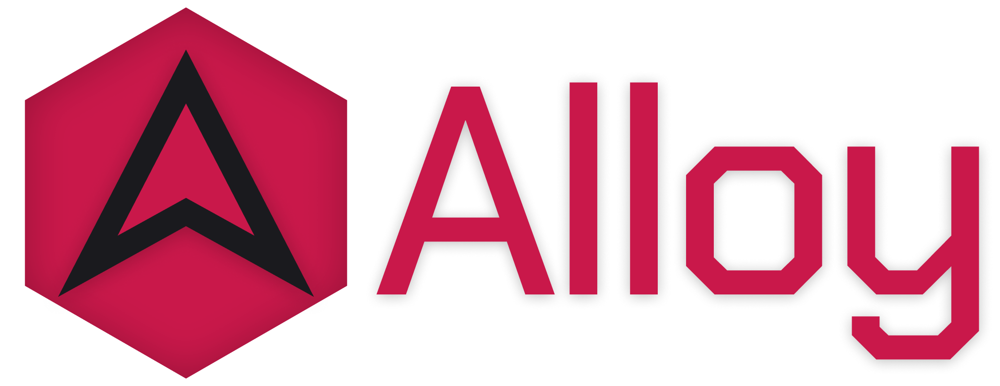

  

Alloy Client is a Realm of the Mad God client for the private server community. Meant for anyone who wants to play around with a few friends, learn how it works, and/or maybe start their own game project in the private server space.

## Introduction
Alloy Client is the required frontend for the [Alloy Server](https://github.com/Zolmex/alloy-server), 
these projects are meant to run together out of the box. 
The pillars that guide the design decisions behind every component in this project are **performance, simplicity, 
and maintainability**.

# Progress
Very unfinished\
Use at your own risk, i can & will push breaking changes at anytime

### Build Requirements
- All platforms
  - [.NET 10 SDK](https://dotnet.microsoft.com/en-us/download/dotnet/10.0)
- Linux:
    - Wine (Requirement for font atlas in content builder)

### Run Requirements
- [.NET 10 Runtime](https://dotnet.microsoft.com/en-us/download/dotnet/10.0)
- OpenGL 4.6 support

# Credits
#### Lead Developers
- [Link](https://github.com/NotTheLegend)
#### With help from
- [Zolmex](https://github.com/Zolmex)
- [HaloC](https://github.com/HaloCelsius)
- [Animus](https://github.com/animusDS)
#### With minor contributions from
* [Cuckson](https://github.com/Cuckson)
* [patpot](https://github.com/patpot)
* [NekoT](https://github.com/EtichBruh)
* runes
* [minuie](https://github.com/minuie)
#### Special thanks to
* [Slendergo](https://github.com/Slendergo/)
* akseli

## License
Alloy is released under the **MIT License**. See [`LICENSE`](./LICENSE) for the full text.